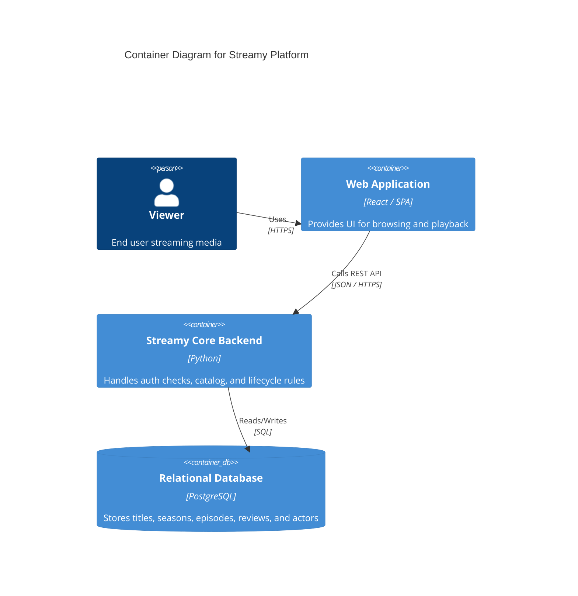

# Streamy Container Architecture

## C4 Container Diagram

```mermaid
C4Container
    title Container Diagram for Streamy Platform
    Person(viewer, "Viewer", "End user streaming media")
    Container(web, "Web Application", "React / SPA", "Provides UI for browsing and playback")
    Container(api, "Streamy Core Backend", "Python", "Handles auth checks, catalog, and lifecycle rules")
    ContainerDb(db, "Relational Database", "PostgreSQL", "Stores titles, seasons, episodes, reviews, and actors")

    Rel(viewer, web, "Uses", "HTTPS")
    Rel(web, api, "Calls REST API", "JSON / HTTPS")
    Rel(api, db, "Reads/Writes", "SQL")
```
